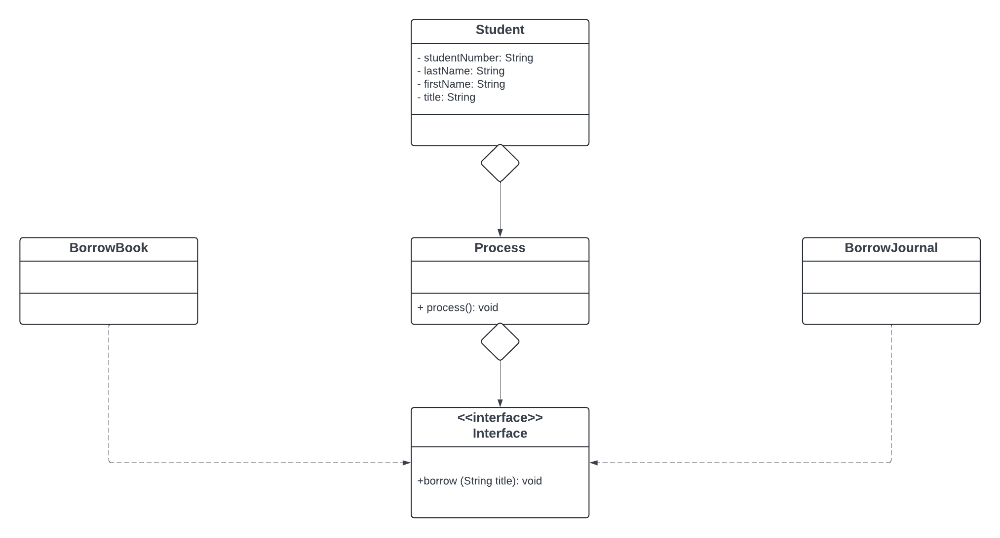

# Laboratory 6 — Dependency Inversion

The NEU Library offers a variety of resources, including books, theses, capstones, internet access, journals, and newspapers.

Currently, the **Student** object has methods like **borrowBook(),** **borrowJournal()** with a parameter of title, which directly depend on specific resource types.

To adhere to the **Dependency Inversion Principle (DIP)** and ensure flexibility for future changes (such as introducing audio books or e[-](https://college.neu.edu.ph/mod/page/view.php?id=68310 "-")journals), we need to refactor the program while maintaining [SOLID principles](https://college.neu.edu.ph/mod/url/view.php?id=153600 "SOLID Principles"). The goal is to create a robust system that can seamlessly accommodate new resource types in the future.

Your solution should not violate other [SOLID principles](https://college.neu.edu.ph/mod/url/view.php?id=153600 "SOLID Principles").

Create a repository in your GitHub account. Put your solution there.
In the readMe file must include the problem statement, UML Class Diagram
 of Proposed solution.

Make sure you have a TestProgram that will validate the proposed refactored codes.

